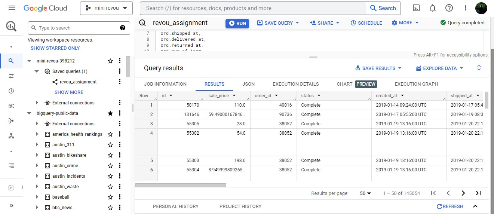
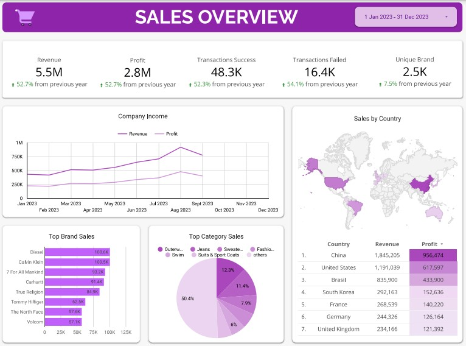
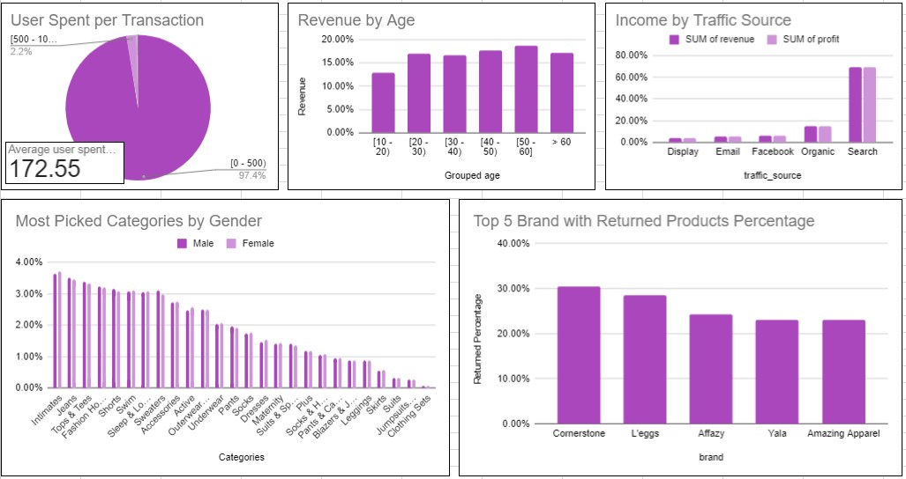

# Revou Week1 Case Study Assignments (optional)

> Tools
- Google Big Query
- Google Data Studio
- Google Spreadsheet

> Database
- Schema : TheLookEcommerce
- Tables : orders, order_items, users, products

> Defining the problems
- How the company's revenue condition, what we can improve.
- How the user's shopping behavior: what categories are often purchased, how they spend money, where they come from, and others. 
- Who are our brand partners: how many brands we have worked together, how are their sales conditions, whether the quality of the products they sell is in line with user expectations.

## Joins needed columns and exports data from BigQuery

## Dashboard for monitoring sales data using GDS

_*plase tell me if data in dashboard is not shown up,_
_because if dashboard is not accessed for long time its need to reconnect manually to the datasource_

### Insight
- There was a 50% increase in revenue and profit this year compared to last year.
- The increase in sales was accompanied by a 54% increase in transaction failures that occurred due to cancelled and returned purchases, which must be reduced.
- besides the increases in sales, there has been a decline in sales in the last month.
- Outerwear & coats, jeans, sweaters are the categories that contributed the most to the company's revenue with a total of 31%.
- The top 5 brands contributing the most sales are Jeans (3) and outerwater & coat (2) manufacturers.
- This year China, America, and Brazil are the countries with the most sales.

## Analyze users behavior using spreadsheet
  <!-- https://docs.google.com/spreadsheets/d/1fsIZXOXhd3yJGGSquIAaLFeKi8391ojiMi5ZkELz1ok/edit?usp=sharing -->
  

### Insight
- Users generally pay a small fee (172 dollars) for each transaction made.
- The majority of users are adults (20 to 60), with elderly users (60+) outnumbering children and youth users (10-20).
- 60% of users make purchases from search.
- Intimates, jaeans, tops and tees are most popular categories for both male and female.
- 30% of sales from cornerstone brands are returned by users, indicating poor product quality.

<!-- [slides](https://docs.google.com/presentation/d/1P2xGUWr7PEwyNoQzhcAD_3Ykt9ib53XsL4Id8K1Gzn8/edit?usp=sharing) -->